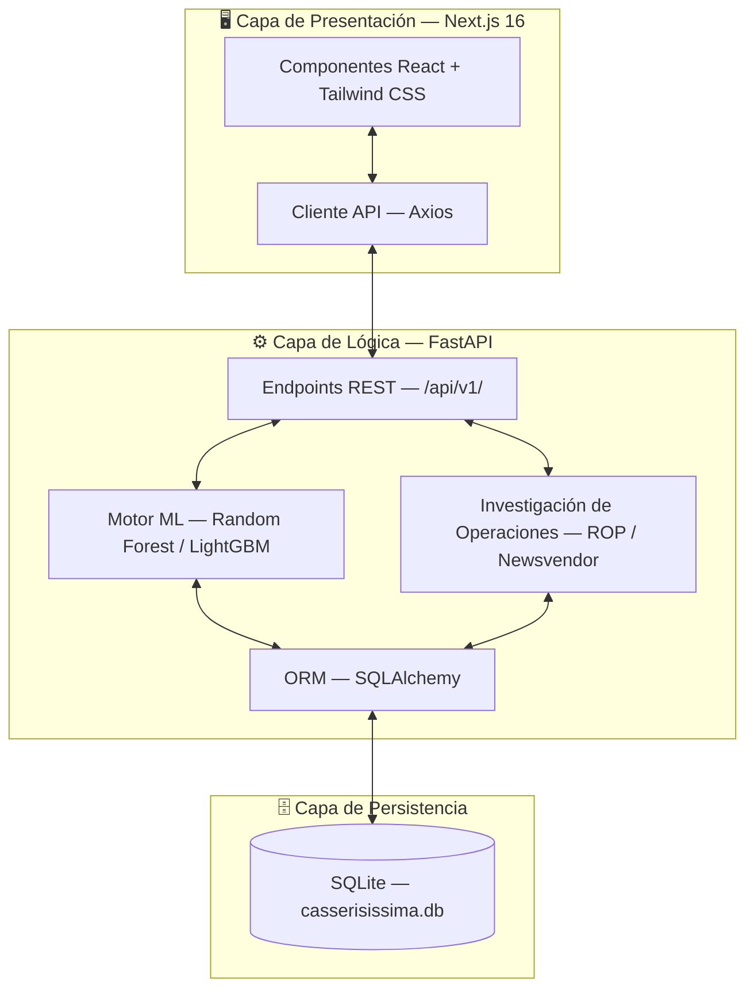
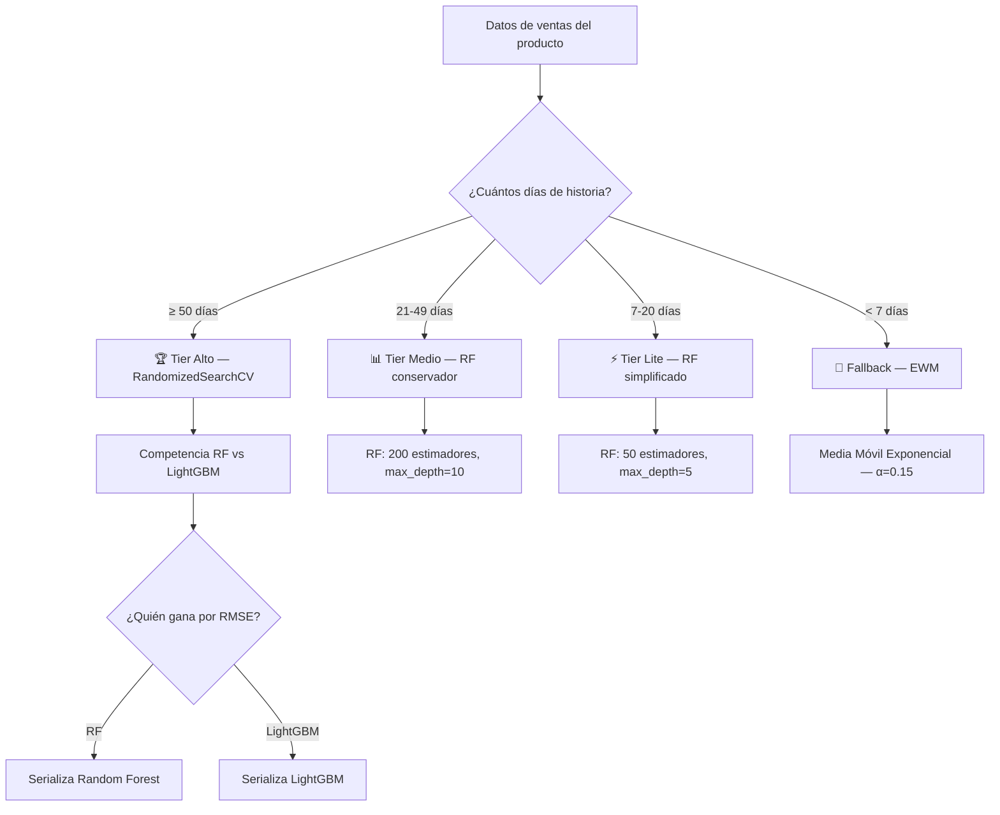
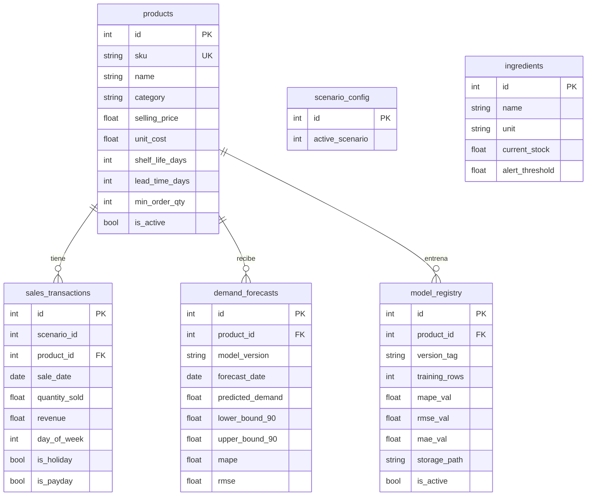

<h1 align="center">
  🍰 CASSERISISSIMA 2.0
</h1>

<h3 align="center">
  Sistema Predictivo Basado en Machine Learning para la Optimización<br>
  de Inventarios Perecederos de la Industria Repostera en la<br>
  Pastelería Casseríssimas, Maturín, Estado Monagas
</h3>

<p align="center">
  <strong>Trabajo Especial de Grado</strong><br>
  Universidad de Oriente — Núcleo de Monagas<br>
  <em>Br. Jorfran Gil · Br. Yefferson Hernández</em>
</p>

<p align="center">
  
  
  
  
  
</p>

---

## 📋 Descripción del Proyecto

**CASSERISISSIMA 2.0** es un sistema inteligente de pronóstico de demanda, optimización de inventarios y gestión de precios diseñado para la Pastelería Casseríssimas, ubicada en Maturín, Estado Monagas, Venezuela.

### Problema

En la repostería artesanal, los productos tienen una **vida útil de 3 a 4 días**. Esto genera un dilema constante:

- **Producir de más** → Merma (productos vencidos que se desechan).
- **Producir de menos** → Quiebre de stock (ventas perdidas y clientes insatisfechos).

### Solución

El sistema utiliza **Machine Learning (Random Forest / LightGBM)** para pronosticar la demanda diaria de cada producto a partir de datos históricos de ventas proporcionados por la pastelería. Con base en esas predicciones, aplica modelos de **Investigación de Operaciones** para determinar:

1. **Cuánto hornear** → Modelo del Vendedor de Periódicos (_Newsvendor_).
2. **Cuándo reponer insumos** → Punto de Reorden Dinámico (_ROP_).

---

## 🏗️ Arquitectura del Sistema



---

## 🤖 Motor de Machine Learning

### Ingeniería de Características (_Feature Engineering_)

El módulo transforma la serie temporal de ventas diarias en un conjunto rico de features:

| Categoría | Features | Descripción |
|-----------|----------|-------------|
| **Lags temporales** | `lag_1`, `lag_3`, `lag_7`, `lag_14`, `lag_21`, `lag_28`, `lag_365` | Demanda histórica en períodos anteriores |
| **Estadísticas móviles** | `rolling_mean_7/14/21`, `rolling_std_7/14` | Tendencia y volatilidad reciente |
| **Momentum** | `ewm_7`, `trend_7d` | Suavizado exponencial y pendiente lineal |
| **Calendario** | `day_of_week`, `month`, `is_weekend`, `is_payday`, `is_holiday` | Patrones estacionales y calendario venezolano |
| **Encoding cíclico** | `dow_sin/cos`, `month_sin/cos`, `dom_sin/cos` | Representación continua de variables periódicas |
| **Interacciones** | `weekend×mean7`, `payday×mean7`, `holiday×std7` | Combinaciones no lineales de features |

### Control de Outliers — Winsorización Adaptativa

Para evitar que eventos excepcionales (un pedido masivo de una fiesta) distorsionen los pronósticos normales:

- **Caso estándar** (IQR > 0): recorta valores por encima de `Q3 + 1.5 × IQR`.
- **Caso de bajo volumen** (IQR = 0): usa el **percentil 99** como límite superior.

### Estrategia de Entrenamiento por Volumen de Datos



### Métricas de Evaluación

| Métrica | Fórmula | Uso en el sistema |
|---------|---------|-------------------|
| **MAPE** | $\frac{1}{n}\sum\frac{\|y_i - \hat{y}_i\|}{y_i}$ | Referencia porcentual (se infla en bajo volumen) |
| **RMSE** | $\sqrt{\frac{1}{n}\sum(y_i - \hat{y}_i)^2}$ | Criterio de selección del modelo ganador |
| **MAE** | $\frac{1}{n}\sum\|y_i - \hat{y}_i\|$ | Indicador operativo clave (error en unidades físicas) |

> **Nota sobre el MAPE en bajo volumen**: cuando un producto vende en promedio 0.3 unidades/día, un error de 0.8 unidades genera un MAPE de ~80% que parece alarmante. Sin embargo, el MAE de 0.3 indica que el modelo falla por menos de un tercio de torta — operativamente excelente.

---

## 📊 Investigación de Operaciones

### Modelo del Vendedor de Periódicos (_Newsvendor_)

Determina la **cantidad óptima a hornear** diariamente, equilibrando el costo de producir de más vs. vender de menos:

$$Q^* = F^{-1}(CR) \quad \text{donde} \quad CR = \frac{P_v - C_u}{P_v}$$

- $P_v$: Precio de venta unitario
- $C_u$: Costo unitario de producción
- $CR$: Ratio crítico (fracción del costo de subproducción sobre el costo total)
- $F^{-1}$: Inversa de la distribución acumulada de la demanda

### Punto de Reorden Dinámico (_ROP_)

Determina **cuándo pedir insumos** al proveedor:

$$ROP = \mu_d \times L + SS$$

Donde el stock de seguridad se calcula como:

$$SS = Z_\alpha \times \sqrt{L \times \sigma_d^2 + \mu_d^2 \times \sigma_L^2}$$

- $\mu_d$: Demanda promedio diaria estimada por el modelo
- $L$: Lead time (días de entrega del proveedor)
- $\sigma_d$: Desviación estándar del error del modelo
- $Z_\alpha$: Factor de servicio (por defecto 1.65 para 95%)

---

## 🗄️ Modelo de Datos



---

## 🧪 Escenarios de Demostración

El sistema incluye 3 escenarios con datos históricos de la pastelería, seleccionables en tiempo real:

| # | Nombre | Período | Días | Propósito |
|---|--------|---------|------|-----------|
| 1 | **Corto** | Dic 2025 – May 2026 | ~172 | Simula un negocio nuevo con poco historial. Mayor incertidumbre y bandas de predicción más anchas. |
| 2 | **Óptimo** | May 2024 – May 2026 | ~730 | Máxima precisión. 2 años completos capturando estacionalidad anual. |
| 3 | **Crítico** | Estrés + Anomalías | ~243 | Evalúa alarmas del sistema ante desabastecimiento, quiebres de stock y demanda errática. |

---

## 📁 Estructura del Proyecto

```
CASSERISISSIMA-2.0/
├── data/                               # Datos del proyecto
│   ├── raw/                            # CSVs originales proporcionados por la pastelería
│   └── models/                         # Modelos ML serializados (.joblib)
│
├── notebooks/                          # Documentación técnica ejecutable
│   ├── 01_random_forest_model.ipynb    # Análisis detallado del modelo de pronóstico
│   ├── 02_capitulo_resultados.ipynb    # Material para capítulo de resultados de la tesis
│   └── 03_como_funciona_mi_sistema.ipynb # Guía técnica del sistema completo
│
├── src/                                # Código fuente — API REST (FastAPI + Python)
│   ├── core/                           # Motores de lógica de negocio
│   │   ├── ml/                         # Pipeline de Machine Learning
│   │   │   ├── feature_engineering.py  # 40+ features temporales y de calendario
│   │   │   ├── model_trainer.py        # Entrenamiento RF/LightGBM con fallback
│   │   │   ├── pipeline.py             # Pipelines scikit-learn serializables
│   │   │   ├── model_registry.py       # Registro y versionado de modelos
│   │   │   └── benchmark.py            # Comparación de métricas por escenario
│   │   └── operations_research/        # Algoritmos de optimización de inventario
│   │       ├── newsvendor.py           # Cantidad óptima de producción
│   │       └── reorder_point.py        # Punto de reorden dinámico
│   ├── db/                             # Capa de persistencia
│   │   ├── database.py                 # Configuración SQLAlchemy
│   │   ├── models.py                   # Esquema ORM de la base de datos
│   │   └── seed.py                     # Carga de datos desde CSV a SQLite
│   ├── routers/                        # Endpoints REST
│   │   ├── dashboard.py                # KPIs y estadísticas generales
│   │   ├── sales.py                    # Registro y consulta de ventas
│   │   ├── predictions.py              # Pronósticos y gráficos ML
│   │   ├── insights.py                 # Alertas e insights automatizados
│   │   └── scenarios.py                # Gestión de escenarios activos
│   ├── main.py                         # Punto de entrada de la aplicación
│   └── requirements.txt                # Dependencias de Python
│
├── frontend/                           # Aplicación Web — Next.js 16 (TypeScript)
│   ├── app/                            # App Router (páginas y estilos)
│   ├── components/                     # Componentes React reutilizables
│   ├── lib/                            # Cliente API y tipos TypeScript
│   └── package.json                    # Dependencias de Node.js
│
├── tests/                              # Tests del sistema
├── docs/                               # Documentación e imágenes
├── .gitignore
├── LICENSE
├── README.md
└── start.ps1                           # Script de inicio unificado
```

---

## 🛠️ Stack Tecnológico

| Capa | Tecnología | Versión | Rol |
|------|-----------|---------|-----|
| **Frontend** | Next.js | 16 | Framework React con App Router |
| | TypeScript | 5.x | Tipado estático |
| | Tailwind CSS | 4.x | Sistema de diseño utility-first |
| | Recharts | 2.x | Gráficos de series temporales |
| | Framer Motion | 11.x | Micro-animaciones |
| **Backend** | FastAPI | 0.110+ | API REST asíncrona |
| | Python | 3.10+ | Lenguaje principal del backend |
| | SQLAlchemy | 2.0+ | ORM para SQLite |
| | Uvicorn | 0.27+ | Servidor ASGI |
| **ML/IA** | scikit-learn | 1.4+ | Random Forest Regressor |
| | LightGBM | 4.0+ | Gradient Boosting como competidor |
| | Pandas | 2.1+ | Manipulación de datos |
| | NumPy | 1.26+ | Cómputo numérico |
| | SciPy | 1.12+ | Distribuciones estadísticas |
| | Joblib | 1.3+ | Serialización de modelos |
| **Base de datos** | SQLite | 3.x | Persistencia local embebida |

---

## 🚀 Instalación y Ejecución

### Requisitos previos

- Python 3.10 o superior
- Node.js 18 o superior
- npm o pnpm

### Instalación

```bash
# 1. Clonar el repositorio
git clone https://github.com/tu-usuario/casserisissima-2.0.git
cd casserisissima-2.0

# 2. Configurar el backend
cd src
python -m venv .venv
.venv\Scripts\activate          # Windows
pip install -r requirements.txt

# 3. Configurar variables de entorno
copy .env.example .env          # Ajustar si es necesario

# 4. Configurar el frontend
cd ../frontend
npm install
```

### Ejecución

```powershell
# Opción A — Script unificado (Windows PowerShell)
.\start.ps1

# Opción B — Manual
# Terminal 1: Backend
cd src
uvicorn main:app --reload --port 8000

# Terminal 2: Frontend
cd frontend
npm run dev
```

### Acceso

| Servicio | URL |
|----------|-----|
| Frontend (Dashboard) | http://localhost:3000 |
| Backend API (Swagger) | http://localhost:8000/docs |
| Backend API (ReDoc) | http://localhost:8000/redoc |

### Regenerar modelos ML

```bash
cd src
python -m core.ml.benchmark          # Escenario 2 (Óptimo) por defecto
python -m core.ml.benchmark 1        # Escenario 1 (Corto)
python -m core.ml.benchmark 3        # Escenario 3 (Crítico)
```

---

## 📝 Licencia

Este proyecto está licenciado bajo la [Licencia MIT](LICENSE).

---

<p align="center">
  <em>Desarrollado como Trabajo Especial de Grado — Universidad de Oriente, Núcleo de Monagas, 2026</em>
</p>
