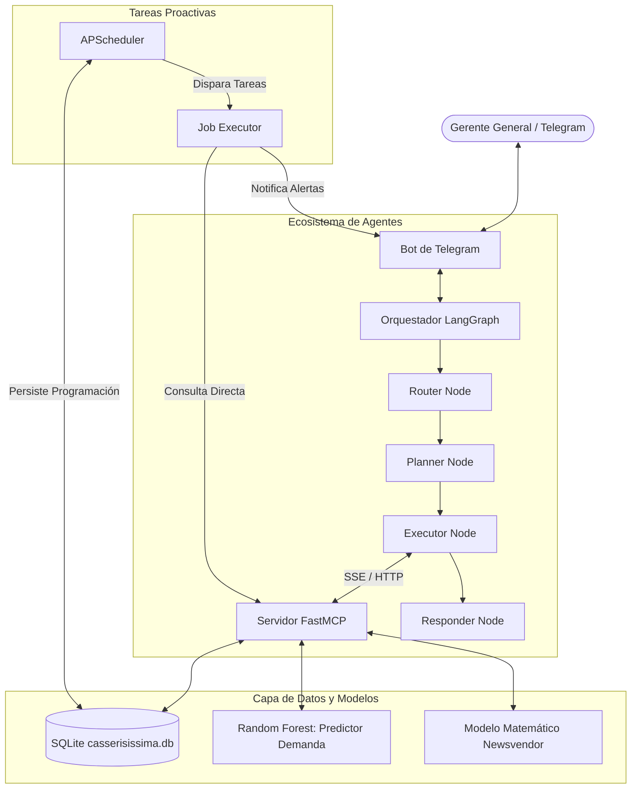

# 🍰 Ecosistema de Agentes Inteligentes: CASSERISISSIMA 2.0 📊

Este documento explica de forma detallada la arquitectura, el funcionamiento interno y el desglose de archivos del ecosistema de agentes inteligentes de **CASSERISISSIMA 2.0**. Este sistema está diseñado como un asistente de operaciones para una pastelería artesanal en Maturín, Venezuela, integrando modelos de Machine Learning (Random Forest) y optimización matemática (Newsvendor).

---

## 🏛️ Arquitectura del Sistema

Este agente opera de forma dependiente y en conjunto con el sistema principal **CASSERISISSIMA 2.0** (ubicado en `C:\Users\Yefferson\Documents\CASSERISISSIMA 2.0`), del cual consume directamente la base de datos `casserisissima.db` y los modelos predictivos pre-entrenados de Machine Learning.

El sistema utiliza una arquitectura distribuida y asíncrona basada en **LangGraph** (orquestación), **FastMCP** (servidor de herramientas), **APScheduler** (proactividad) y **python-telegram-bot** (interfaz).

---

## 🛠️ Desglose de Componentes y Archivos

El proyecto está organizado de forma modular. A continuación, se detalla la función de cada archivo y carpeta:

### 1. ⚙️ Configuración y Entrada Principal
*   **[`main.py`](file:///c:/Users/Yefferson/Documents/project/agente%20de%20ia%20casserissima/main.py):** Punto de entrada del sistema. Inicia de manera concurrente (usando `multiprocessing`) el servidor FastMCP en el puerto 8000 y el Bot de Telegram. Al arrancar, restaura los trabajos programados de la base de datos y envía un mensaje de saludo inicial ("en línea") a los chats autorizados.
*   **[`config/settings.py`](file:///c:/Users/Yefferson/Documents/project/agente%20de%20ia%20casserissima/config/settings.py):** Gestión de configuraciones globales y carga de variables de entorno mediante `pydantic-settings`. Define rutas de bases de datos, tokens y IDs autorizados.
*   **[`.env`](file:///c:/Users/Yefferson/Documents/project/agente%20de%20ia%20casserissima/.env):** Archivo local que almacena credenciales sensibles (`TELEGRAM_TOKEN`, `GEMINI_API_KEY`, etc.).

---

### 2. 🤖 Orquestación de Agentes (`agent/`)
*   **[`agent/graph.py`](file:///c:/Users/Yefferson/Documents/project/agente%20de%20ia%20casserissima/agent/graph.py):** Construye y compila el flujo de trabajo (DAG) usando **LangGraph**.
    *   `router_node`: Clasifica el mensaje del usuario utilizando Gemini.
    *   `tool_planner_node`: Decide qué herramientas de MCP ejecutar y extrae los parámetros (ej. ID de producto).
    *   `tool_executor_node`: Abre un cliente SSE (Server-Sent Events) contra el servidor MCP y ejecuta las herramientas.
    *   `responder_node`: Redacta la respuesta final al usuario, integrando el contexto obtenido por las herramientas.
*   **[`agent/state.py`](file:///c:/Users/Yefferson/Documents/project/agente%20de%20ia%20casserissima/agent/state.py):** Define el esquema de estado que viaja a través de los nodos de LangGraph (mensajes, intención, herramientas a llamar y resultados).
*   **[`agent/llm/factory.py`](file:///c:/Users/Yefferson/Documents/project/agente%20de%20ia%20casserissima/agent/llm/factory.py):** Crea la instancia del modelo de lenguaje. Prioriza `gemini-3.5-flash` con un mecanismo de reintentos automático (`max_retries=3`) para tolerar los límites de la capa gratuita, y tiene un fallback automático a Ollama local (`hermes3`) en caso de no contar con clave.
*   **[`agent/prompts/system_prompt.py`](file:///c:/Users/Yefferson/Documents/project/agente%20de%20ia%20casserissima/agent/prompts/system_prompt.py):** Contiene el System Prompt que define la personalidad profesional del asistente y el Router Prompt para categorizar intenciones.

---

### 3. 🌐 Servidor y Herramientas MCP (`mcp_server/`)
*   **[`mcp_server/server.py`](file:///c:/Users/Yefferson/Documents/project/agente%20de%20ia%20casserissima/mcp_server/server.py):** Inicializa y ejecuta el servidor FastMCP por transporte SSE en el puerto 8000. Registra todas las herramientas expuestas para el agente.
*   **[`mcp_server/tools/products.py`](file:///c:/Users/Yefferson/Documents/project/agente%20de%20ia%20casserissima/mcp_server/tools/products.py):** Herramienta `list_products`. Obtiene el catálogo disponible en la pastelería.
*   **[`mcp_server/tools/inventory.py`](file:///c:/Users/Yefferson/Documents/project/agente%20de%20ia%20casserissima/mcp_server/tools/inventory.py):**
    *   `check_inventory`: Consulta el nivel de ingredientes de la base de datos.
    *   `get_rop_alerts`: Analiza si algún insumo se encuentra por debajo de su Punto de Reorden (ROP), sugiriendo compras inmediatas.
*   **[`mcp_server/tools/demand_forecast.py`](file:///c:/Users/Yefferson/Documents/project/agente%20de%20ia%20casserissima/mcp_server/tools/demand_forecast.py):** Herramienta `predict_demand`. Reutiliza de forma directa el script del modelo Random Forest entrenado en el backend de CASSERISISSIMA 2.0 para predecir la demanda futura del producto.
*   **[`mcp_server/tools/newsvendor.py`](file:///c:/Users/Yefferson/Documents/project/agente%20de%20ia%20casserissima/mcp_server/tools/newsvendor.py):** Herramienta `calculate_optimal_production`. Integra los datos predictivos del Random Forest con los costos de producción y escasez del producto, calculando la producción óptima teórica mediante el modelo matemático de Newsvendor.
*   **[`mcp_server/tools/scheduling.py`](file:///c:/Users/Yefferson/Documents/project/agente%20de%20ia%20casserissima/mcp_server/tools/scheduling.py):** Herramienta `create_scheduled_job`. Registra tareas programadas directamente en la base de datos a petición del usuario.

---

### 4. 💬 Interfaz de Usuario: Telegram (`bot/`)
*   **[`bot/telegram_bot.py`](file:///c:/Users/Yefferson/Documents/project/agente%20de%20ia%20casserissima/bot/telegram_bot.py):** Configura e instancia la aplicación de Telegram (`python-telegram-bot`), registrando los manejadores de comandos e interacciones de texto.
*   **[`bot/handlers/command_handler.py`](file:///c:/Users/Yefferson/Documents/project/agente%20de%20ia%20casserissima/bot/handlers/command_handler.py):** Maneja los comandos de Telegram como `/start`, `/help` y valida los accesos.
*   **[`bot/handlers/message_handler.py`](file:///c:/Users/Yefferson/Documents/project/agente%20de%20ia%20casserissima/bot/handlers/message_handler.py):** Procesa el texto que envía el usuario en lenguaje natural, ejecuta de forma asíncrona el orquestador de agentes de LangGraph y envía la respuesta formateada al chat de origen. Cuenta con un decodificador JSON integrado para asegurar que las respuestas del LLM se desplieguen limpiamente.

---

### 5. ⏰ Tareas Proactivas (`bot/scheduler/`)
*   **[`bot/scheduler/persistent_scheduler.py`](file:///c:/Users/Yefferson/Documents/project/agente%20de%20ia%20casserissima/bot/scheduler/persistent_scheduler.py):** Configura `APScheduler` para la ejecución asíncrona de alertas automáticas.
*   **[`bot/scheduler/job_executor.py`](file:///c:/Users/Yefferson/Documents/project/agente%20de%20ia%20casserissima/bot/scheduler/job_executor.py):** Ejecuta la lógica proactiva de forma periódica. Por ejemplo, al dispararse una alarma a las 7:00 AM, este módulo realiza las llamadas necesarias de datos, calcula el pronóstico de producción y le envía el resumen automáticamente al Gerente General por Telegram.

---

### 6. 🗄️ Base de Datos (`database/`)
*   **[`database/connection.py`](file:///c:/Users/Yefferson/Documents/project/agente%20de%20ia%20casserissima/database/connection.py):** Crea los motores SQLAlchemy síncrono y asíncrono para operar de forma eficiente con SQLite.
*   **[`database/models.py`](file:///c:/Users/Yefferson/Documents/project/agente%20de%20ia%20casserissima/database/models.py):**
    *   `ScheduledJob`: Tabla que persiste las tareas periódicas programadas (`cron_expression`, `chat_id`, `job_type`, `parameters`).
    *   `AgentLog`: Registro de auditoría del comportamiento del agente, registrando cuándo y qué herramientas se invocaron.
*   **[`migrate.py`](file:///c:/Users/Yefferson/Documents/project/agente%20de%20ia%20casserissima/migrate.py):** Script de migración inicial que crea de manera segura las tablas `scheduled_jobs` y `agent_logs` en la base de datos existente de Casserisissima sin corromper los datos anteriores.

---

## 🔄 Flujo de Trabajo Típico de una Consulta

1. **Entrada:** El Gerente envía en Telegram: *"¿Cuántas tortas de chocolate debo preparar para mañana?"*.
2. **Recepción:** `message_handler.py` recibe el texto y llama a `graph.ainvoke(initial_state)`.
3. **Clasificación (Router):** `router_node` le pasa el texto a Gemini, quien clasifica la intención como `production_planning`.
4. **Planificación (Planner):** `tool_planner_node` recibe la intención `production_planning`, determina que requiere la herramienta `calculate_optimal_production` y extrae el ID del producto (o asigna el default `TF-001`).
5. **Ejecución (Executor):** `tool_executor_node` abre la conexión SSE al puerto 8000, llama a `calculate_optimal_production(product_id="TF-001")`, la cual internamente:
    *   Consulta la base de datos para obtener precios y costos.
    *   Llama al Random Forest del backend para calcular la demanda futura de mañana.
    *   Calcula el cuantil óptimo (Newsvendor) y devuelve un JSON con el resultado.
6. **Redacción (Responder):** `responder_node` concatena la respuesta cruda de la herramienta con el contexto de la pastelería. El prompt del sistema fuerza a que Gemini adopte el tono de un asesor preciso y profesional.
7. **Salida:** El bot de Telegram decodifica el formato JSON del mensaje y despliega la respuesta limpia con un diseño legible y escaneable.
