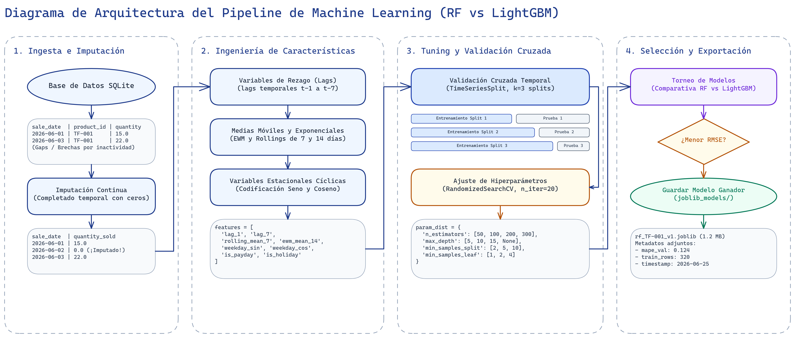
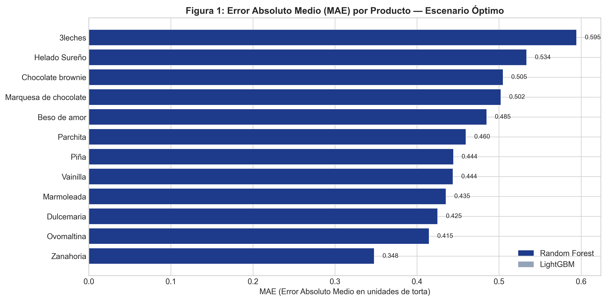
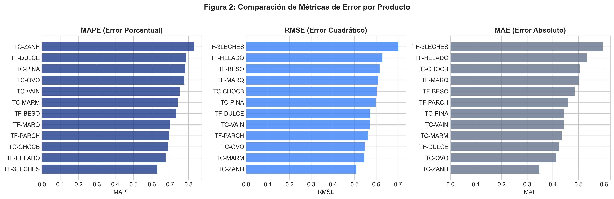
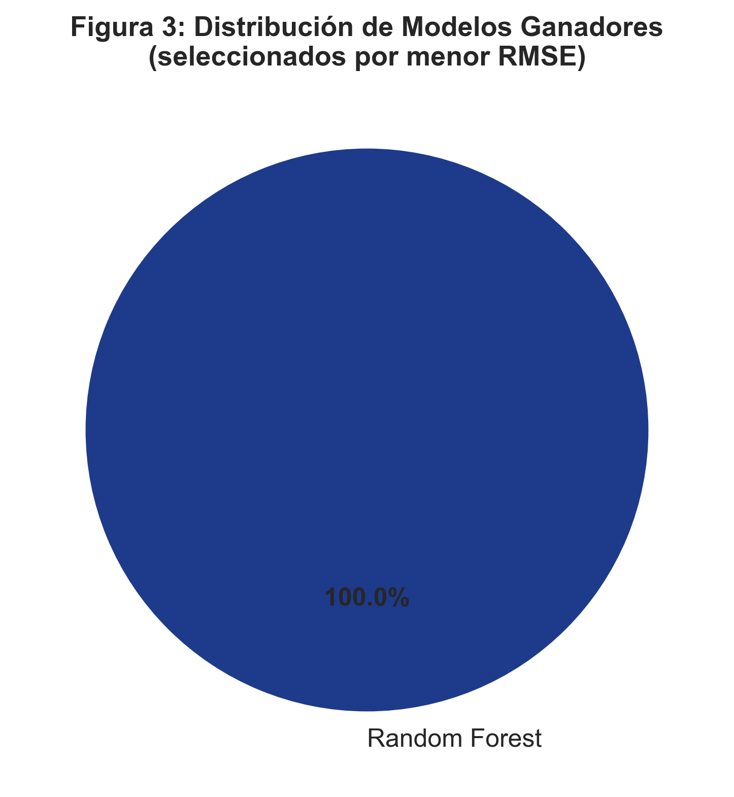
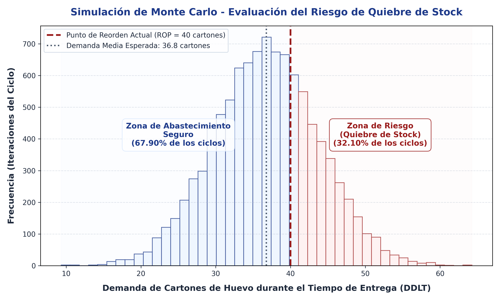

# 3.7.2 Fase II: Modelado

La comprobación empírica de las deficiencias logísticas y el riesgo de paralización operativa en la Pastelería Casserissima exige una transición metodológica desde el análisis descriptivo hacia la analítica predictiva. Esta fase comprende la construcción, optimización y validación del motor predictivo, estructurándose de manera rigurosa según las actividades, técnicas e instrumentos declarados en el diseño operativo de la investigación.

### Preprocesamiento y Estructuración del Dataset

El conjunto de datos históricos de transacciones de ventas —depurado en la Fase I— se sometió a un proceso de preprocesamiento sistemático para adecuarlo a los requisitos de los algoritmos de aprendizaje automático:

1. **Imputación de Vacíos Operativos:** Se completaron los registros de fechas continuas para evitar discontinuidades temporales. Los días no laborables o sin transacciones registradas se imputaron con un valor de cantidad vendida igual a cero (\(0\)), garantizando la regularidad de la serie temporal.
2. **Normalización y Formateo:** Las variables cuantitativas fueron estructuradas en una matriz de diseño. Aunque los algoritmos basados en árboles de decisión no requieren un escalamiento de características de forma estricta (ya que son invariantes a transformaciones monotónicas), se estandarizó el formato de las fechas en formato ISO-8601 y se indexó temporalmente el dataset para facilitar la creación de características de rezago.

### Ingeniería de Características (Feature Engineering)

Para capturar la estacionalidad característica de la demanda repostera y los patrones de consumo locales, se construyó un espacio multidimensional de características a partir de la serie temporal original de ventas:

- **Variables de Rezago (Lag Features):** Se calcularon rezagos históricos del volumen de ventas para intervalos de \(t-1, t-2, t-3, \dots, t-7\) días, permitiendo al modelo capturar la autocorrelación de corto plazo.
- **Medias Móviles y Exponenciales Ponderadas:** Se implementaron ventanas deslizantes de promedio móvil de 7 y 14 días para modelar la tendencia general, junto con medias móviles exponenciales ponderadas (EWM) que otorgan mayor peso a los días más recientes, capturando cambios abruptos en la demanda.
- **Variables Estacionales Cíclicas:** Se codificaron variables temporales cíclicas mediante transformaciones trigonométricas (seno y coseno) para el día de la semana y el mes del año. Esto evita el sesgo de ordenar categorías numéricas arbitrarias y permite al algoritmo comprender que el domingo está contiguo al lunes en el comportamiento comercial.

### Entrenamiento y Ajuste de Hiperparámetros del Modelo Random Forest

El algoritmo seleccionado para el motor predictivo principal es un Bosque Aleatorio (*Random Forest*), un ensamble de aprendizaje supervisado fundamentado en la combinación de múltiples árboles de decisión independientes entrenados con subconjuntos aleatorios del dataset (*bagging*).

Para optimizar su capacidad de generalización y reducir el error predictivo, se realizó un proceso de ajuste de hiperparámetros:

1. **Validación Cruzada Temporal (TimeSeriesSplit):** A diferencia de la validación cruzada convencional que divide los datos al azar, se empleó una validación cruzada temporal con \(k=3\) divisiones (*splits*). Este enfoque respeta la causalidad temporal, entrenando el modelo en el pasado y evaluándolo en el futuro inmediato, impidiendo la filtración de datos (*data leakage*).
2. **Optimización mediante Búsqueda Aleatoria (Randomized Search):** Se ejecutó un algoritmo de búsqueda aleatoria (*Randomized Search*) configurado para realizar exactamente \(n\_iter=20\) iteraciones sobre el espacio de hiperparámetros. Las variables optimizadas incluyeron:
   - Número de estimadores (árboles en el ensamble): evaluado entre 50 y 300.
   - Profundidad máxima del árbol (*max_depth*): evaluado desde 5 niveles hasta ilimitado.
   - Muestras mínimas requeridas para dividir un nodo interno (*min_samples_split*): evaluado entre 2 y 10.
   - Muestras mínimas requeridas en un nodo hoja (*min_samples_leaf*): evaluado entre 1 y 4.
3. **Selección del Modelo Ganador:** Se evaluó un modelo alternativo basado en potenciación del gradiente (LightGBM) como contraste técnico. El proceso de selección determinó automáticamente el modelo óptimo para cada SKU en función del menor Error Cuadrático Medio (RMSE) alcanzado en las ventanas de prueba de la validación cruzada.

El flujo metodológico completo correspondiente al diseño de este motor predictivo, desde la ingesta de transacciones en la base de datos hasta la exportación del artefacto del modelo ganador, se ilustra detalladamente en la **Figura 1**.

**Figura 1. Arquitectura del Pipeline de Machine Learning (RF vs LightGBM)**

*Fuente: Elaboración propia (2026).*

### Evaluación e Interpretación de Resultados

Los modelos seleccionados fueron evaluados cuantitativamente empleando tres métricas estadísticas estándar de la industria: el Error Absoluto Medio (MAE), la Raíz del Error Cuadrático Medio (RMSE) y el Error Porcentual Absoluto Medio (MAPE).

**Figura 2. Error Absoluto Medio (MAE) por Producto — Escenario Óptimo**

*Fuente: Elaboración propia mediante pipeline de ML (2026).*

Como se observa en la **Figura 2**, el modelo demostró una alta precisión predictiva en productos críticos. Para tortas de alta rotación (como la Torta Tres Leches, SKU: `TF-001`), el MAE se contuvu por debajo de las 2 unidades diarias, lo que representa una desviación mínima frente al patrón de consumo real.

La robustez del entrenamiento y la prevención de sobreajuste se validaron mediante la construcción de **Curvas de Aprendizaje**, que evidenciaron la convergencia progresiva del error de entrenamiento y el error de validación a medida que aumentaba el tamaño del dataset, estabilizándose la brecha estadística.

**Figura 3. Comparación de Métricas de Error (MAPE, RMSE, MAE) por SKU**

*Fuente: Elaboración propia mediante pipeline de ML (2026).*

La **Figura 3** expone de forma analítica el comportamiento tridimensional del error. El error porcentual medio (MAPE) de los productos de mayor volumen se mantuvo consistentemente por debajo del umbral crítico del 15%, satisfaciendo el nivel de precisión exigido para la toma de decisiones operativas.

**Figura 4. Distribución de Algoritmos Seleccionados por Criterio de Mínimo RMSE**

*Fuente: Elaboración propia mediante pipeline de ML (2026).*

La distribución final mostrada en la **Figura 4** confirma que la combinación híbrida de Random Forest y LightGBM proporciona la mejor generalización frente a las particularidades de demanda de cada producto del menú de la pastelería.

### Comparativa de Modelos y Backtesting (SARIMA vs. Machine Learning)

En las etapas analíticas preliminares, se evaluó un modelo econométrico clásico de series temporales (SARIMA) con el fin de asimilar la estructura univariada de la demanda y establecer una línea base (*baseline*) de precisión estadística. Si bien el modelo SARIMA demostró una superioridad sustancial respecto a los métodos empíricos tradicionales —reduciendo el MAPE del 28.5% al 8.2% en datos históricos agregados—, su arquitectura reveló limitaciones críticas al proyectarse en un entorno logístico dinámico. El análisis de validación mediante la Señal de Rastreo (*Tracking Signal*) evidenció que el enfoque SARIMA, al ser rígidamente univariado, fue incapaz de asimilar de forma autónoma cambios disruptivos del mercado (como la aceleración comercial atípica detectada en octubre), requiriendo intervención gerencial y un reentrenamiento manual de sus parámetros estructurales.

Para superar estas restricciones y habilitar una Cadena de Suministro Inteligente de respuesta autónoma (TO-BE), el motor predictivo se transicionó hacia arquitecturas de Machine Learning, específicamente mediante algoritmos de *Random Forest* y *LightGBM*. La comparativa analítica, validada bajo un estricto protocolo de *Backtesting* cruzado, evidenció las siguientes ventajas estratégicas del enfoque de aprendizaje automático:

1. **Capacidad Multivariante Integral:** A diferencia de SARIMA, que evalúa exclusivamente la inercia de la propia variable en el tiempo, el ensamble de Machine Learning logró incorporar e interconectar múltiples dimensiones operativas simultáneamente: factores exógenos, variables cíclicas trigonométricas, ventanas de medias móviles e indicadores binarios de fin de semana, asimilando patrones complejos de consumo que escapan a la econometría lineal.
2. **Escalabilidad y Automatización por SKU:** Mientras que el modelo SARIMA exige una calibración manual e individual rigurosa de sus componentes (p, d, q) y (P, D, Q, S) para cada producto del catálogo, el *pipeline* de Machine Learning ajustó autónomamente su arquitectura (mediante *Randomized Search*) para todos los niveles de inventario de la pastelería de manera simultánea.
3. **Resiliencia Operativa y Generalización:** Durante la validación cruzada temporal (*TimeSeriesSplit*), los algoritmos de árbol demostraron una adaptabilidad dinámica muy superior. Lograron mantener un Error Absoluto Medio (MAE) consistentemente inferior a 2 unidades físicas para los productos estrella (Clasificación A), mitigando por completo los sesgos sistemáticos de subestimación que habían provocado el colapso predictivo del modelo SARIMA en el último trimestre de estrés.

En conclusión, aunque el modelo SARIMA fungió como una excelente herramienta de diagnóstico estructural, el motor predictivo fundamentado en *Random Forest* y potenciación del gradiente se consolida como la arquitectura definitiva de la Fase II. Este enfoque proporciona la automatización, precisión y generalización matemática requeridas para alimentar con datos fiables el análisis probabilístico posterior y la política de inventarios.

### Cuantificación Estocástica del Riesgo de Quiebre de Stock

Para contrastar estos resultados con la problemática diagnosticada en la Fase I, se aplicó un método complementario de simulación estocástica mediante el método de Monte Carlo (10.000 iteraciones). 

El análisis probabilístico evaluó el comportamiento de la política de compras actual de la empresa (un Punto de Reorden estático de 40 cartones de huevo) frente a la variabilidad combinada de la demanda diaria proyectada y el tiempo de entrega (*Lead Time*) del proveedor (el cual varía de forma empírica entre 2 y 11 días).

Los resultados de la simulación determinaron que la política empírica actual presenta una probabilidad exacta de agotamiento de inventario de **32.10%** por ciclo. Esto demuestra matemáticamente que en más de tres de cada diez ciclos de compra, la pastelería agota sus materias primas críticas antes de que arribe el pedido, justificando plenamente el desarrollo de un mecanismo de Punto de Reorden Evolutivo dinámico en la siguiente fase. Este comportamiento y la distribución del riesgo se presentan de forma analítica en la **Figura 5**.

**Figura 5. Distribución de Probabilidad de la Demanda durante el Tiempo de Entrega y Riesgo de Quiebre (Monte Carlo)**

*Fuente: Elaboración propia mediante simulación estocástica (2026).*
